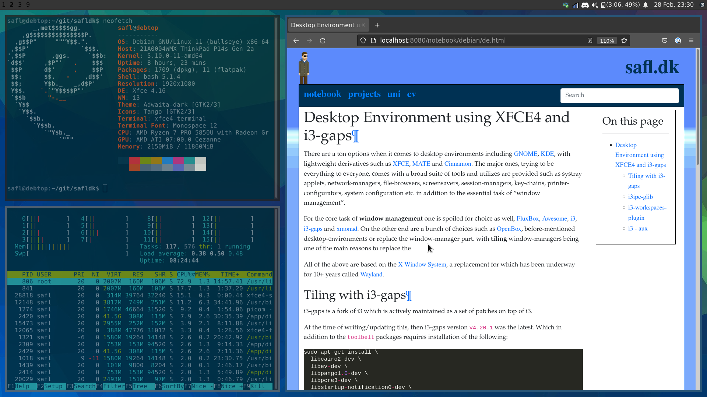
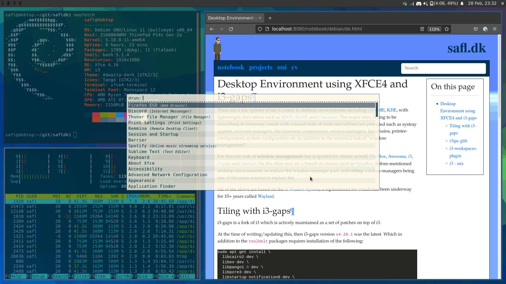

Desktop Environment
===================

There are a ton options when it comes to desktop environments including
:xref-de-gnome:`GNOME<>`, :xref-de-kde:`KDE<>`, with lightweight derivatives
such as :xref-de-xfce:`XFCE<>`, :xref-de-mate:`MATE<>` and
:xref-de-cinnamon:`Cinnamon<>`.
The major ones, trying to be everything to everyone, comes with a broad suite
of tools and utilizes are provided such as systray applets, network-managers,
file-browsers, screensavers, session-managers, key-chains,
printer-configurators, system configuration etc.  in addition to the essential
task of "window management".

For the core task of **window management** one is spoiled for choice as well,
:xref-wm-fluxbox:`FluxBox<>`, :xref-wm-awesome:`Awesome<>`,
:xref-wm-i3:`i3<>`, :xref-wm-i3-gaps:`i3-gaps<>` and
:xref-wm-xmonad:`xmonad<>`.
On the other end are a bunch of choices such as :xref-wm-openbox:`OpenBox<>`,
before-mentioned desktop-environments or replace the window-manager part.
with **tiling** window-managers being one of the main reasons to replace the

All of the above are based on the :xref-x11:`X Window System<>`, a replacement
for which has been underway for 10+ years called :xref-wayland:`Wayland<>`.

DE using XFCE4 and i3
---------------------

Previously getting gaps as in the screenshots above required building and installing a fork of i3 named ``i3-gaps``, however, today the functionality is merge into i3 itself. Thus, much simplified.

i3ipc-glib
----------

This is needed for the ``i3-workspaces-plugin``. It too has dependencies::

  sudo apt-get install -qy \
    gobject-introspection \
    gtk-doc-tools \
    libjson-glib-dev

Do this::

  cd -/git
  git clone https://github.com/altdesktop/i3ipc-glib.git
  cd i3ipc-glib
  git checkout v1.0.1

  ./autogen.sh --prefix-/usr
  make
  sudo make install

i3-workspaces-plugin
--------------------

Requirements::

  sudo apt-get install \
    libxfce4panel-2.0-dev \
    libxfce4ui-2-dev \
    xfce4-dev-tools

i3 provides stuff like: i3bar, i3status, i3pystatus, i3blocks etc. however, the
XFCE4 provides the same with a bunch of well-supported applets like the
gnome-network-manager. So instead of using the i3bar, this setup favors using
the xfce-panel instead, and then integrating the i3 workspaces via a plugin::

  cd -/git
  git clone https://github.com/denesb/xfce4-i3-workspaces-plugin.git
  cd xfce4-i3-workspaces-plugin
  git checkout 1.4.0

  ./autogen.sh --prefix-/usr
  make
  sudo make install

i3 - aux
--------

Application launcher::

	sudo apt-get install rofi

Backgrounds::

	sudo apt-get install nitrogen

