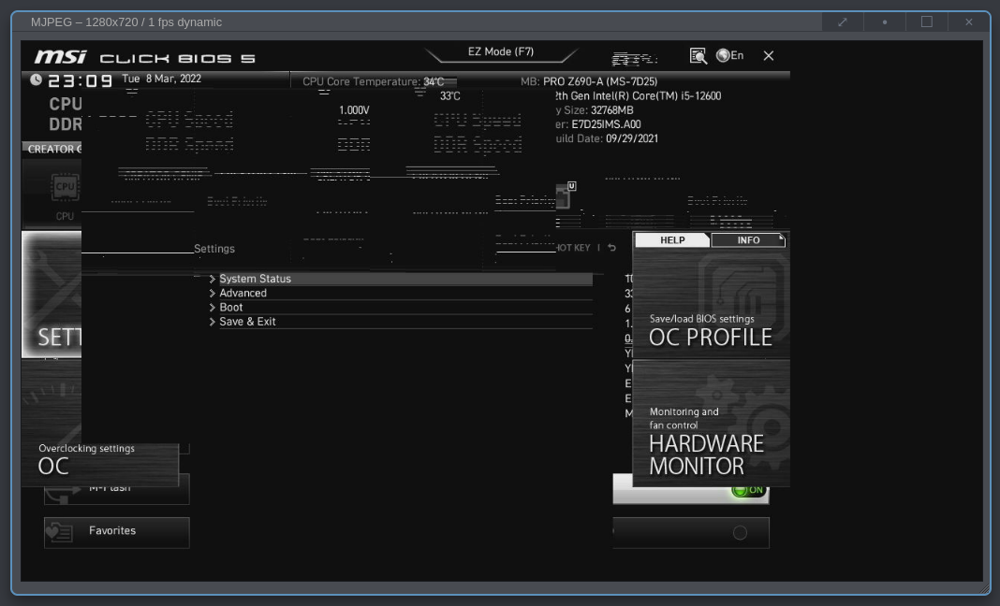

PiKVM with v3 HAT
=================

From the download-page, grab ``v3-hdmi-rpi4-latest.img.xz`` and write it to
sdcard. Assemble the thing and let it boot.

Post-installation tasks in the PiKVM shell::

  # Change storage to read/write mode
  rw

  # Change the hostname
  hostnamectl set-hostname <the-new-hostname>

  # Disable WiFi and Bluetooth
  echo "dtoverlay=disable-wifi" >> /boot/config.txt
  echo "dtoverlay=disable-bt" >> /boot/config.txt

  # Change the password
  passwd root

  # Change password for ui
  kvmd-htpasswd set admin

  # Enable the oled-display of the steel-case
  systemctl enable --now kvmd-oled kvmd-oled-reboot kvmd-oled-shutdown
  systemctl enable --now kvmd-fan

  # Change storage to read-only mode
  ro

Troubleshooting
---------------

A couple of notes on issues faced and how to solve them. For more, then 

Garbled graphics
~~~~~~~~~~~~~~~~

In case your BIOS/UEFI looks and behaves weird, here is an example of weird:

then you probably needs the tweak the **edid**. For details look at
`PiKVM-edid`_. In my case using a ``MSI PRO Z690-A``, then it looked like the
picture above and the following custom-edit fixed it::

  # Switch to root
  su -

  # Change storage-mode to read-write
  rw

  # Update the edit
  echo "00FFFFFFFFFFFF005262888800888888
  1C150103800000780AEE91A3544C9926
  0F505425400001000100010001000100
  010001010101D32C80A070381A403020
  350040442100001E7E1D00A050001940
  3020370080001000001E000000FC0050
  492D4B564D20566964656F0A000000FD
  00323D0F2E0F000000000000000001C4
  02030400DE0D20A03058122030203400
  F0B400000018E01500A0400016303020
  3400000000000018B41400A050D01120
  3020350080D810000018AB22A0A05084
  1A3030203600B00E1100001800000000
  00000000000000000000000000000000
  00000000000000000000000000000000
  00000000000000000000000000000045" > /etc/kvmd/tc358743-edid.hex

  # Refresh it
  v4l2-ctl \
    --device=/dev/kvmd-video \
    --set-edid=file=/etc/kvmd/tc358743-edid.hex \
    --fix-edid-checksums

  # Change storage-mode to read-only
  ro

A power-cycle of the target-machine might be needed, it was for me. I am
assuming that some video-subsystem probably needed re-negotiating. The above
worked for me, however, you should probably have a look at the manual and how
to "test" an edid, before you overwrite it like above. It is the same steps,
but instead of writing the edid to ``tc358743-edid.hex`` then you write it to
temporary file and run ``v4l2-ctl`` to see that it works.

Keyboard / mouse are not working
~~~~~~~~~~~~~~~~~~~~~~~~~~~~~~~~

If you find that mouse / keyboard is not working then check:

* Make sure you have the small USB-C bridge connected. That is the thing that
  lies with the ATX-pcb. Without it, then mouse/keyboard won't work.

* Make sure you are connected the USB-cabel from the PiKVM to the
  target-machine.

* Make sure that USB works on your target-machine.

* That you used the right image, e.g. if you use a v2 image with the v3 hat,
  then mouse/keyboard won't work. This might seem obvious, but I made the
  mistake of just grabbing the first download-link on the download-page,
  instead of reading the page and grabbing the one for v3... so... if nothing
  else works, then this might be why.

.. _PiKVM-edid: https://docs.pikvm.org/edid/#default-edid
